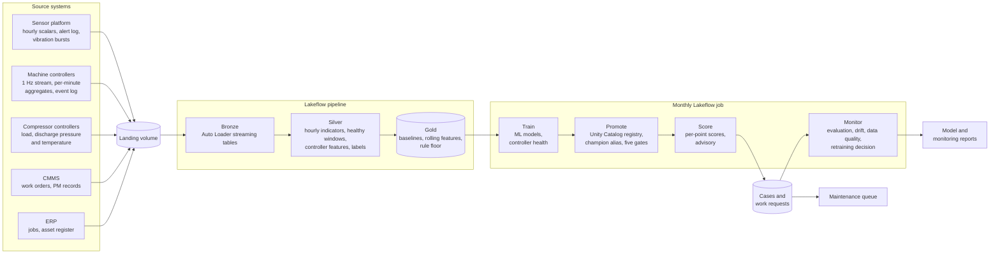

# Machine Learning Model: Predictive Maintenance

This project is built on generated vibration and temperature sensor data, machine and compressor controller data, and ERP and CMMS exports. The sensor data is transmitted wirelessly to the vendor's cloud platform, which exports it as Parquet files. The controller data is read over MTConnect (the HMCs) and Modbus (the compressors), published on an MQTT UNS, and written to Parquet files. All exports land in Azure Databricks, where a Lakeflow pipeline transforms them and a monthly job trains, scores and monitors the models through MLflow and the Unity Catalog model registry. 

All code related to the ML model (training, scoring, alerting and evaluation) and data / ML engineering is organized below in the Code section. 

---

<br>

A **Predictive Maintenance ML model** (anomaly detection) was built on the past three years of the shop's records. Every hour, it reads vibration and temperature measurements from 40 wireless sensor points on eight HMCs and four plant compressors, along with each machine’s load and speed from its controller. When readings depart from a sensor point’s normal behavior, the model raises an ALERT (inspection needed), escalating to an ALARM (urgent repair) when the condition becomes severe. The model is detailed in the [model report](https://bmdvs.github.io/predictive-maintenance-ml/reports/model_report.html) and summarized below.

- **Results.** The table below compares the predictive maintenance model (ML Model) against the Vendor Rules method, which is the shop's existing condition monitoring layer. Vendor Rules applies fixed threshold alerts on sensor measurements: velocity, high-frequency acceleration and bearing fault bands, and its ALERTs and ALARMs drive maintenance requests. The ML Model ran in shadow mode beside Vendor Rules during the evaluation year (July 2025 to June 2026), with its ALERTs and ALARMs recorded and not acted on, in order to evaluate its performance. As shown below, the ML Model achieved notable improvements over Vendor Rules.
  - Against 32 confirmed conditions, the ML Model caught 23 against Vendor Rules’ 22, with 41% fewer false ALERTs and 61% fewer false ALARMs.
  - On the 18 conditions both methods caught, the ML Model's ALERTs gave a median 23.7 days of warning against 21.3.

<div align="center">

<b>ML Model vs. Vendor Rules, July 2025 to June 2026</b>

| | Conditions caught | Median warning (days) | False ALERTs per asset-month | False ALARMs per asset-month | Inspection hours on false alerts |
|:---|:---:|:---:|:---:|:---:|:---:|
| Vendor Rules | 22 of 32 | 21.3 | 0.235 | 0.137 | 63 |
| **ML Model** | **23 of 32** | **23.7** | **0.140** | **0.054** | **37** |

</div>

- **Purpose and use.** Each hour, the ML Model scores every sensor point against its learned normal behavior. It raises an ALERT (inspection needed) or an ALARM (urgent repair) and opens a work request with the suspected condition and a recommended inspection. During the evaluation year, Vendor Rules drove the maintenance queue and the ML Model's status was shown beside it. 
- **Model training.** The model was trained on July 2023 to June 2025 and selected on expanding-window folds within that period. The evaluation year, July 2025 to June 2026, was held out until the model was chosen. The record holds 84 confirmed conditions on the sensor points: 52 in training and 32 in evaluation.
  - An autoencoder (a neural network ML model) is trained for each sensor point and learns its normal behavior from 13 sensor measurements (velocity, high-frequency acceleration, envelope fault bands, shaft-order energies, crest factor, kurtosis and temperature), plus operating data from the machines' controllers.
  - The model is trained on the point's healthy hours and re-centered after each repair and sensor remount.
  - The model flags ALERTs above the 99.5th percentile of healthy scores, held for six hours. An open ALERT escalates to an ALARM when the asset also crosses a severity criterion for its class: velocity in the ISO danger zone, a late-stage bearing signature, a spindle or compressor temperature limit, or sustained pump cavitation.
- **Model evaluation.**
  - **Selection.** Four model types (autoencoder, Mahalanobis distance, PCA, isolation forest) were compared across five input sets, trained and scored on the training data, and the best model (autoencoder) was selected.
  - **Detection.** Evaluation is event-based against confirmed conditions, with the same scope, crediting and false-alert definitions applied to both methods. On 32 conditions, the ML Model’s 23 catches vs. Vendor Rules' 22 is within what chance could produce; the ML Model's lower false-alert rate is found to be statistically significant (90% interval: 16% to 61% lower).
  - **Diagnosis.** The ML Model’s work requests named the confirmed condition for 14 of the 23 conditions it caught, including all 6 bearing defects; Vendor Rules alerts name only the measurement that crossed its limit.
  - Full evaluation and technical detail are in the [model report](https://bmdvs.github.io/predictive-maintenance-ml/reports/model_report.html).
- **Production monitoring.** A monthly monitor evaluates the ML Model against its retraining rules: catch share and alert rate are the primary triggers, and feature and score drift the secondary, alongside data-quality checks and Databricks data profiling. Over the evaluation year the primary trigger fired in September and October 2025, on catch shares of 0.33 and 0.50 against a 0.54 limit, so a full refit is recommended, as detailed in the [monitoring report](https://bmdvs.github.io/predictive-maintenance-ml/reports/monitoring_report.html).

The Vendor Rules' and ML Model's statuses and work requests are presented in a [maintenance queue](https://bmdvs.github.io/predictive-maintenance-ml/) in the shop's CMMS, one row per asset at ALERT or ALARM:

[](https://bmdvs.github.io/predictive-maintenance-ml/)

Clicking on an asset in the maintenance queue reveals a detail section showing measurement trends, fault-band energies, envelope spectra and controller signals, as well as a maintenance history table (not shown in the screenshot below):

[](https://bmdvs.github.io/predictive-maintenance-ml/)

---

## Business Context

A precision machining shop runs 40 CNC machines. Its eight horizontal machining centers (HMCs) are the bottleneck: they carry 29% of the shop’s cutting hours at 71% utilization, and an hour of HMC downtime costs $185 in contribution margin, 1.7x the average for the rest of the fleet. Spindle and pump failures on the HMCs stop the shop's highest-margin work.

In July 2023 the shop began a pilot of sensor-based condition monitoring on the HMC cell and the compressors: wireless sensors on 40 points, monitored as 28 assets (each HMC's spindle, through-spindle coolant (TSC) pump and flood coolant pump, and each compressor). These sensors were monitored by the sensor vendor's threshold alerts, Vendor Rules, alongside interval-based PM. Vendor Rules was found to produce a high rate of false alerts: its ALERTs led to 204 machine inspections from July 2023 to June 2025, and 79% of those found nothing wrong.

To lower this false alert rate, and to catch developing faults earlier, the pilot's second phase added the ML Model. Built on the same sensor record, it ran in shadow mode beside Vendor Rules over the evaluation year to prove its effectiveness.

---

## Deliverables

| # | Deliverable | What it is | Links |
|---|---|---|---|
| 1 | Maintenance queue | The shop's CMMS maintenance queue: one row per asset at ALERT or ALARM under either method, with Vendor Rules' status, the ML Model's shadow status, the suspected condition and the work request. Each asset's detail section holds the ML Model score and measurement trends against Vendor Rules limits, fault-band energies, envelope spectra at the alert and now, controller signals and maintenance history. | [View](https://bmdvs.github.io/predictive-maintenance-ml/) |
| 2 | Model report | Detection and warning against Vendor Rules, escalation to ALARM and diagnosis; the model overview, training data detail, scoring summary and condition signatures; model selection, validation, false alerts and misses, and limitations. | [View](https://bmdvs.github.io/predictive-maintenance-ml/reports/model_report.html) |
| 3 | Monitoring report | The ML Model’s retraining status for the evaluation year: the retraining rules evaluated month by month; catch share, alert rate and false alerts by month; feature and score drift; data quality; and the champion model and post-repair re-centering. | [View](https://bmdvs.github.io/predictive-maintenance-ml/reports/monitoring_report.html) |

---

## Code

### ML Model (training, scoring, alerting and evaluation)

| File | What it does |
|---|---|
| [`models/nbm.py`](src/pdm/models/nbm.py), [`models/nbm_pyfunc.py`](src/pdm/models/nbm_pyfunc.py) | Trains and scores the anomaly detection ML models (autoencoder, Mahalanobis distance, PCA, isolation forest), one for each sensor point, with inputs re-centered at each repair or remount, and wraps them in MLflow for the registry. |
| [`models/controller_health.py`](src/pdm/models/controller_health.py) | Scores the controller signals: spindle and axis load drift per program, the spindle thermistor residual and the compressor discharge temperature residual, for all 40 machines. |
| [`rules/`](src/pdm/rules/) | Alerting by Vendor Rules, replayed from the sensor platform export, and by the ISO 20816-3 zone rule, with the persistence and suppression every alerting layer shares. |
| [`advisory/requests.py`](src/pdm/advisory/requests.py) | Opens work requests at ALERT, with a suspected condition and recommended inspection from the measurement pattern. |
| [`evaluation/events.py`](src/pdm/evaluation/events.py) | Evaluates each method against confirmed conditions: catches, warning, and false alerts and false ALARMs per asset-month. |

### Data & ML Engineering

| File | What it does |
|---|---|
| [`databricks/scripts/`](databricks/scripts/) | Sets up the platform: Unity Catalog, landing the exports, service principal grants and the data profiles, as reproducible CLI scripts. |
| [`databricks.yml`](databricks.yml), [`databricks/`](databricks/) | Deploys the Declarative Automation Bundle: dev and prod targets, the Lakeflow pipeline and the monthly job. |
| [`src/pdm/entrypoints.py`](src/pdm/entrypoints.py), [`src/pdm/tasks.py`](src/pdm/tasks.py) | Runs the monthly job as Python wheel tasks: train, promote, score and monitor. |
| [`src/pdm/registry.py`](src/pdm/registry.py) | Promotes the champion and challenger in the Unity Catalog model registry, through the five promotion gates. |
| [`src/pdm/monitoring/performance.py`](src/pdm/monitoring/performance.py) | Monitors event performance per method, feature and score drift each month, and makes the retraining decision. |
| [`src/pdm/reports/`](src/pdm/reports/) | Publishes the queue and both reports from the gold snapshot in [`data/gold_snapshot/`](data/gold_snapshot/). |
| [`src/pdm/parity.py`](src/pdm/parity.py) | Tests the pipeline and every job task locally on the exports, checked against the workspace's tables. |
| [`.github/workflows/ci.yml`](.github/workflows/ci.yml) | Lints and tests every change, and validates the bundle when workspace credentials are configured. |

---

## Data and ML Pipeline


```mermaid
flowchart LR
  subgraph SRC["Source systems"]
    SP["Sensor platform<br/>hourly scalars, alert log,<br/>vibration bursts"]
    CNC["Machine controllers<br/>1 Hz stream, per-minute<br/>aggregates, event log"]
    CMPC["Compressor controllers<br/>load, discharge pressure<br/>and temperature"]
    CMMS["CMMS<br/>work orders, PM records"]
    ERP["ERP<br/>jobs, asset register"]
  end
  subgraph PIPE["Lakeflow pipeline"]
    BRZ["Bronze<br/>Auto Loader streaming tables"]
    SLV["Silver<br/>hourly indicators, healthy windows,<br/>controller features, labels"]
    GLD[("Gold<br/>baselines, rolling features,<br/>rule floor")]
  end
  subgraph JOB["Monthly Lakeflow job"]
    TRAIN["Train<br/>ML models,<br/>controller health"]
    PROM["Promote<br/>Unity Catalog registry,<br/>champion alias, five gates"]
    SCORE["Score<br/>per-point scores,<br/>advisory"]
    MON["Monitor<br/>evaluation, drift, data quality,<br/>retraining decision"]
  end
  SP --> LAND
  CNC --> LAND
  CMPC --> LAND
  CMMS --> LAND
  ERP --> LAND
  LAND[("Landing volume")] --> BRZ
  BRZ --> SLV --> GLD
  GLD --> TRAIN --> PROM --> SCORE
  SCORE --> CASES[("Cases and<br/>work requests")]
  CASES --> MON
  CASES --> QUEUE["Maintenance queue"]
  MON --> REP["Model and<br/>monitoring reports"]
```

Exports from the sensor platform, machine controllers, compressor controllers, CMMS and ERP land in a Unity Catalog volume. A Lakeflow pipeline loads them into bronze tables and builds the silver and gold tables, with data-quality expectations on each. Along the way, each hourly vibration burst is reduced to condition indicators, and each point's healthy windows are set from the asset register and CMMS. The monthly job then:
- trains the challengers;
- promotes one to champion in the Unity Catalog registry when it passes its gates;
- scores every point from the champion and opens work requests from its ALERTs;
- monitors performance, drift and data quality.

The pipeline and job are deployed from a Declarative Automation Bundle, and GitHub Actions lints and tests every change.

---

## Data

The datasets were generated to represent typical exports from a wireless vibration monitoring platform, CNC and compressor controllers, a CMMS and an ERP, so the full workflow can be shared publicly. The record covers July 2023 to June 2026 and holds:
- hourly sensor scalars and retained vibration bursts;
- controller minute aggregates and events;
- compressor controller data;
- CMMS work orders and PM records;
- ERP jobs and the asset register.

The data is built from each machine's physical properties and published degradation mechanisms, in order to generate data that's as close as possible to real machine data. The faults were not shaped to suit either monitoring method, and neither the ML Model nor Vendor Rules plays any part in generating it.

- **Machines and operation.** Vibration bursts are synthesized at 25,600 samples a second from each point's kinematics: shaft speed from the controller, and bearing defect frequencies from the bearing geometry in the asset register. Spindle speed and cutting load follow the ERP's jobs and programs, so healthy levels shift with speed and rise with load, as they do on a real spindle. Housing temperature follows load and season in a climate-controlled shop.
- **Degradation.** Each condition develops through its published signature:
  - bearing defects through the four degradation stages, from envelope peaks at the fault frequency to rising kurtosis and, late, velocity;
  - lubrication loss as rising high-frequency energy and temperature;
  - pump seal and impeller wear as energy at running speed and broadband;
  - rotary-union leaks as a drop in through-spindle coolant pressure;
  - spindle cooling faults as a temperature rise.
- **Maintenance and the record.** Vendor Rules alerts raise inspections that confirm a condition or find nothing. PMs, repairs and sensor remounts reset levels, and failures stop machines. CMMS failure codes carry the miscoding rate of a real record, and the sensor data carries idle periods and implausible rows.
- **Operating events that are not faults.** Heavy cuts, titanium jobs, new programs and coolant drift move the measurements without any condition behind them, as they do on a working floor.

Realism checks test each mechanism against its published behavior, and the record was frozen before any model was trained. The generators are in [`generate/`](generate/) and the checks in [`generate/checks/`](generate/checks/).

---

## Running it locally

```bash
# 1. Environment
python -m venv .venv
source .venv/bin/activate          # Windows: .venv\Scripts\activate
pip install -e ".[dev,spark]"

# 2. Generate the source exports, run the realism checks and write the run report
python -m generate

# 3. The pipeline and every job task on the local exports
python -m pdm.parity

# 4. The queue and the reports from the gold snapshot
python -m pdm.reports.build

# 5. Lint and tests
ruff check . && pytest
```

On the platform, from a configured Databricks CLI:

```bash
databricks bundle validate -t prod
databricks bundle deploy -t prod
databricks bundle run -t prod pdm_monthly --no-wait
```

The page build writes standalone HTML to [`docs/`](docs/), which GitHub Pages serves.

---

## Stack

| Layer | Tools |
|---|---|
| Platform | Azure Databricks, Unity Catalog, Azure Data Lake Storage Gen2 |
| Ingestion & transformation | Lakeflow Declarative Pipelines (Auto Loader, materialized views, expectations), PySpark, Delta Lake |
| Orchestration & deployment | Lakeflow Jobs (Python wheel tasks), Declarative Automation Bundles, GitHub Actions, service principal |
| Signal processing | NumPy, SciPy (filtering, envelope analysis, spectra) |
| Modeling | scikit-learn (autoencoder, PCA, isolation forest, Mahalanobis distance) |
| Model tracking & registry | MLflow, Unity Catalog model registry |
| Monitoring | SciPy (Wasserstein distance), Databricks data profiling |
| Data generation | Python, NumPy, pandas |
| Reporting | matplotlib, HTML/CSS, GitHub Pages |

---

**Author:** Brian Davis. Data engineering and applied analytics/ML for manufacturers.

**Link:** https://github.com/bmdvs
